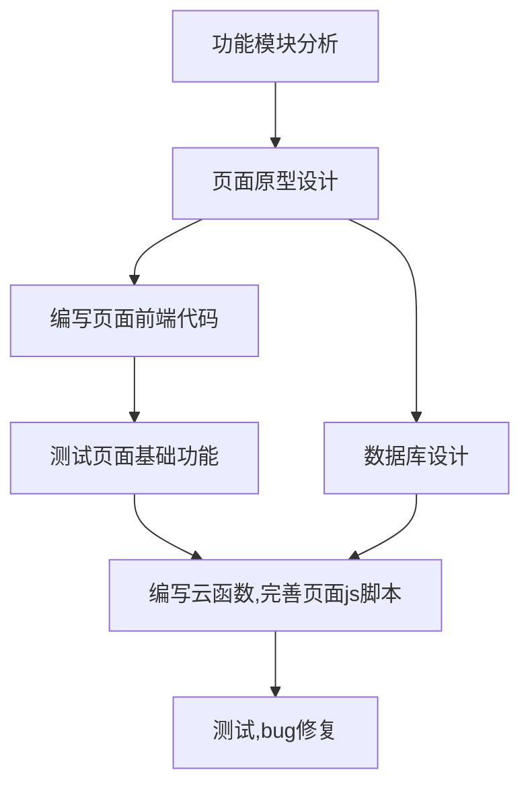

### 计划

------

#### 功能模块分析

---

（尽量写一些比较系统功能，不要写那种很具体细小的功能）

* 用户登录

* 用户相关信息管理

* 每个贴吧的帖子列表展示

* 每个帖子的内容展示

* 搜索帖子（各种方法）

* 回复通知和艾特通知

* 帖子收藏

* 创建新的帖子

* 楼层回复

  

#### 页面原型设计

---

* 每个页面的UI图设计

* 各个页面的跳转逻辑分析

* 各个页面所需实现的功能

  

#### 编写页面前端代码

---

* 可以考虑使用[有赞的UI 组件库](https://github.com/youzan/vant-weapp)
* 尽量模块化，方便自己以后修改
* 每个人尽量独立负责自己所编写页面的前端展示代码，只留下js的部分函数由负责云数据库的云函数的人完成

#### 测试页面基础功能

---

* 这个要和编写页面前端代码那一步交替进行多次

#### 大概想法

---

不用一次把所有页面和功能都实现，分几个阶段由简到繁

一阶段

- [ ] 用户注册
- [ ] 用户登录
- [ ] 展示用户关注的贴吧的常逛的贴吧
- [ ] 展示贴吧的所有帖子
- [ ] 展示每个帖子里的内容（暂时不添加回复功能）
- [ ] 用户可查看自己发过的帖子
- [ ] 贴吧相关数据管理（名字，关注的人，关注数，包含的帖子，帖子数）